# Stillup

Stillup is an uptime and cron heartbeat monitoring app: schedule HTTP checks, receive dead-man’s-switch pings from jobs, open incidents with email alerts, and publish a public status page per project.

## Features

- HTTP uptime checks (interval, expected status, optional keyword)
- Cron / queue heartbeat dead-man’s-switch
- Incidents with acknowledge / resolve
- Email alerts (Mailhog in local Docker)
- Public status page + JSON endpoint
- Org/project RBAC + audit logs
- Ops dashboard (counts, needs attention, recent failures)

## Stack

Laravel 11 · PHP 8.3 · MySQL 8 · Redis · Sanctum · Inertia React + Tailwind · Docker Compose · Mailhog

## Screenshots

### Dashboard
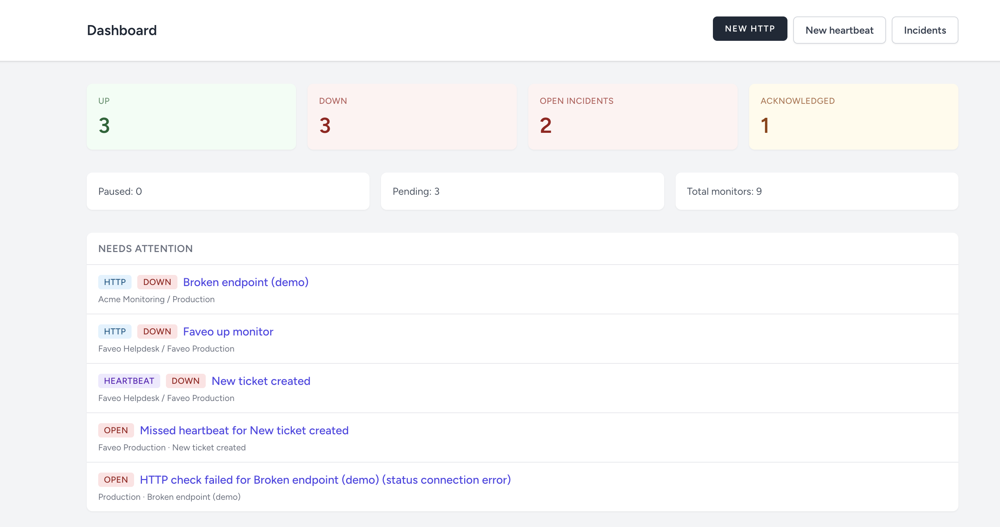

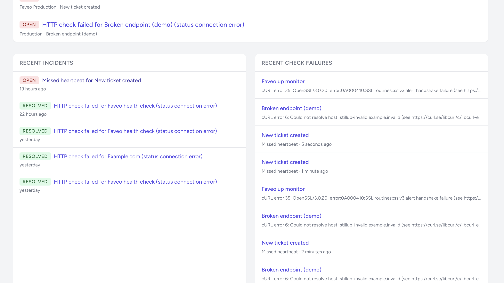

### Organizations
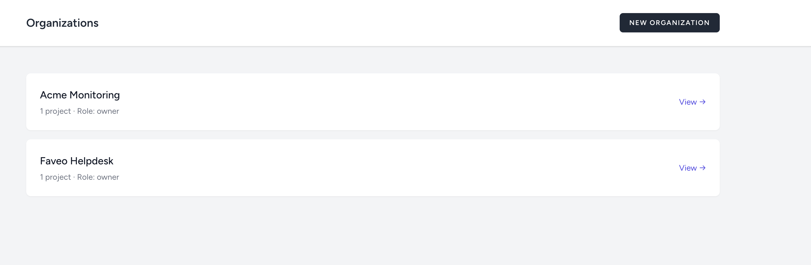

### Monitors
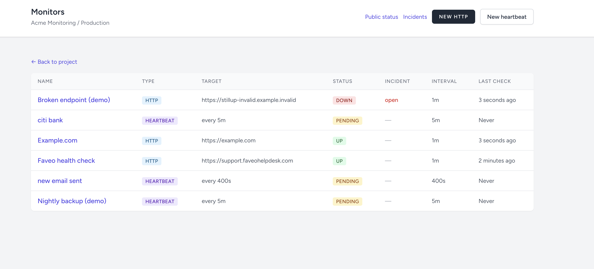

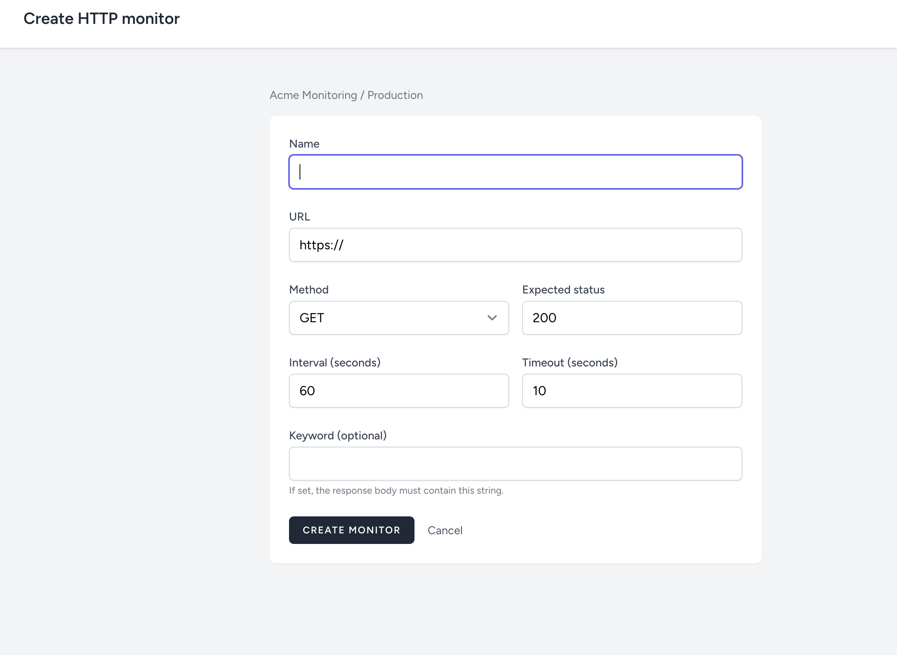

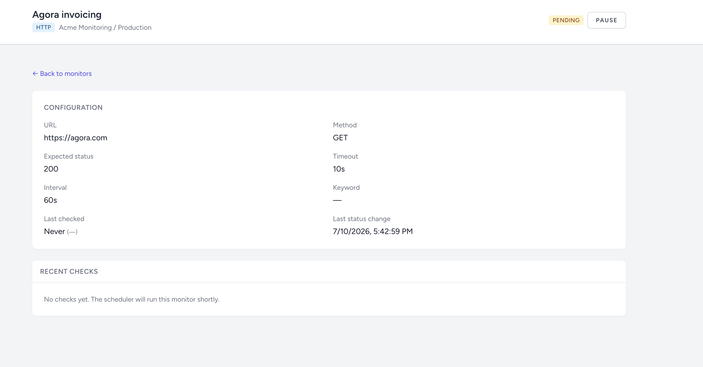

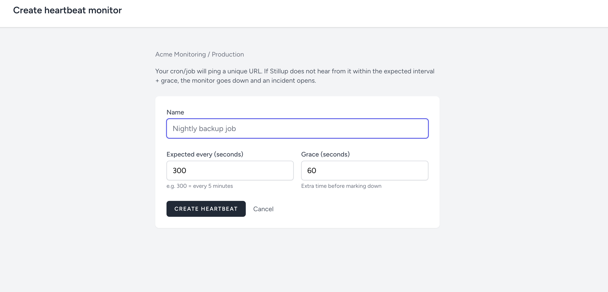

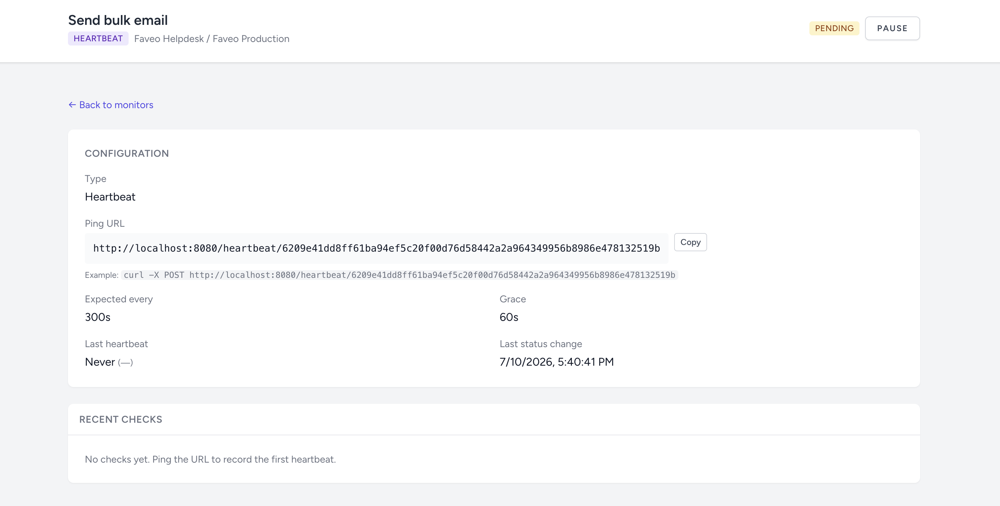

### Incidents & alerts
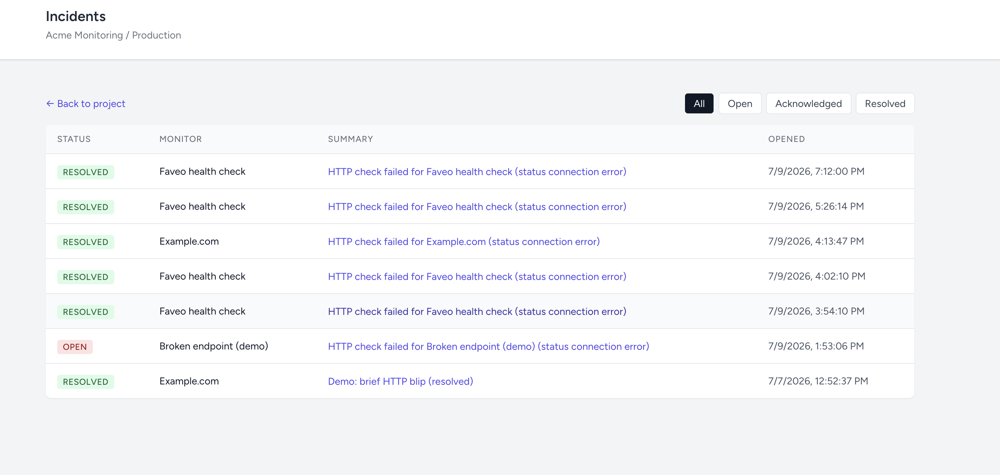

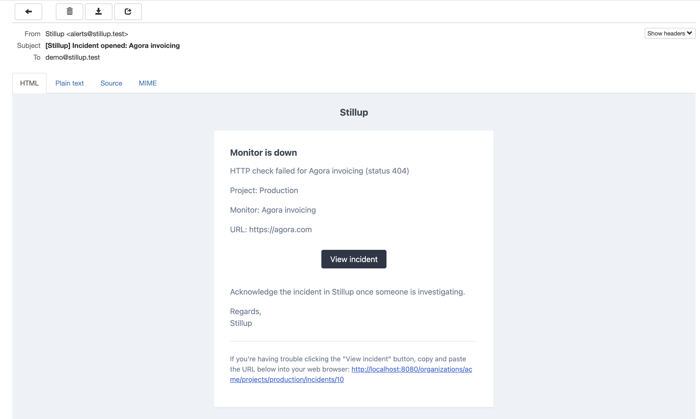

### Public status page
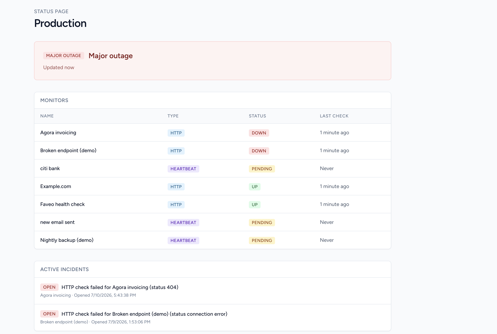

## Quick Start (Docker)

```bash
git clone <your-repo-url> stillup-app
cd stillup-app
cp .env.example .env

docker compose up -d --build
docker compose exec app php artisan key:generate
docker compose exec app php artisan migrate --seed
# or: docker compose exec app php artisan stillup:demo

npm install && npm run build
```

Open:

| Service | URL |
|---------|-----|
| App | http://localhost:8080 |
| Mailhog | http://localhost:8025 |
| Health | http://localhost:8080/up |

**Required containers:** `app`, `nginx`, `mysql`, `redis`, `queue`, `scheduler`, `mailhog`.  
HTTP checks, heartbeat miss detection, and alert emails need the **scheduler** and **queue** workers.

## Demo credentials

```
Email:    demo@stillup.test
Password: password
```

Demo project: **Acme Monitoring → Production**  
Public status: http://localhost:8080/status/production  
Heartbeat curl is printed by `php artisan stillup:demo` / migrate --seed.

## Demo script (5–7 steps)

1. **Login** at http://localhost:8080/login with the demo credentials.
2. Open **Dashboard** — see monitor counts and quick actions.
3. Open **Nightly backup (demo)** → copy the ping URL → run:
   ```bash
   curl -X POST http://localhost:8080/heartbeat/<token-from-monitor-page>
   ```
   Monitor flips to **up**.
4. **Simulate a miss:** either wait past `expected_every + grace` (seeded as 5m + 1m), or in tinker set `last_heartbeat_at` far in the past and run `php artisan schedule:run` (or wait for the scheduler container).
5. Confirm an **incident** opens and an email appears in **Mailhog** (http://localhost:8025).
6. Open the **public status page** logged out: http://localhost:8080/status/production (major outage while down).
7. **Acknowledge / resolve** the incident from the UI; recovery also auto-resolves when the next successful check/ping lands.

**HTTP failure demo:** leave **Broken endpoint (demo)** enabled — the scheduler will mark it down and open an incident within about a minute.

## Architecture

Thin controllers → **Actions** / **Services** → Eloquent.  
Background work: **Jobs** on Redis (`queue` container) + Laravel **scheduler** (`scheduler` container) every minute for HTTP dispatch and heartbeat miss detection.  
Authorization via **Policies** (owner / admin / member / viewer). Mutations write **audit logs**.

## Heartbeat integration example

```bash
# One-shot ping
curl -X POST https://your-stillup.example/heartbeat/YOUR_TOKEN
```

Laravel scheduler (on the monitored app):

```php
// routes/console.php (monitored application)
Schedule::call(function () {
    Http::post(config('services.stillup.heartbeat_url'));
})->everyFiveMinutes();
```

Or from cron:

```cron
*/5 * * * * curl -fsS -X POST https://your-stillup.example/heartbeat/YOUR_TOKEN
```

## Testing

```bash
docker compose exec app php artisan test
# or locally with phpunit sqlite:
php artisan test
```

## License

MIT
